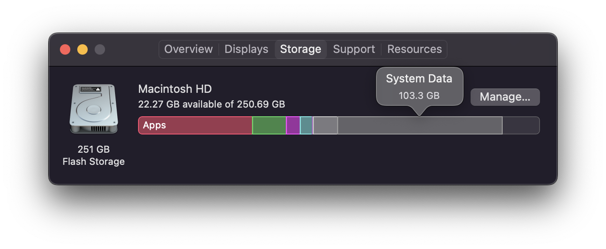

# CleanMyMac
This is a Python project that (as of now) clears the cache of your Mac.

After running the Python script, two files will be created:

- a CSV file which contains the list of files deleted and their respective file size
- a log file (which contains the logs of this application)

## Inspiration
The inspiration for this honestly came from cleaning my mac. When I reviewed my storage, I saw that more than 100 Gigabytes of data was "System Data". After searching for resources online on freeing up said data, I discovered several sites mentioned to delete the caches. 

Problems:

- Some sites mentioned to not delete the directories since your OS may depend on them... Manually deleting files from each directory is time consuming.
- There are sophisicated software out there that takes care of this, but the ones I have encountered are not free.

# Prerequisites

- Python 3 installed (preferably 3.9)
- A MacBook 😂

# Getting Started

- Clone this project
- Update `cache_directory` path
- Run `python3.9 cleanmymac.py`